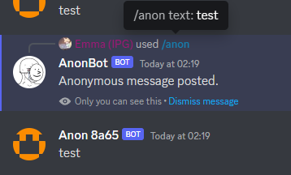

# Discord-AnonBot

A single-file Discord bot for anonymous messaging in Discord threads, written in PHP. Made in 20 minutes on request of a friend for their Discord server.

This uses Discord's interaction webhooks, so this can be run on any regular PHP-enabled nginx or Apache2 (not recommended) server.

This will only work in forum threads, not any other channels.

